<p align="center">
  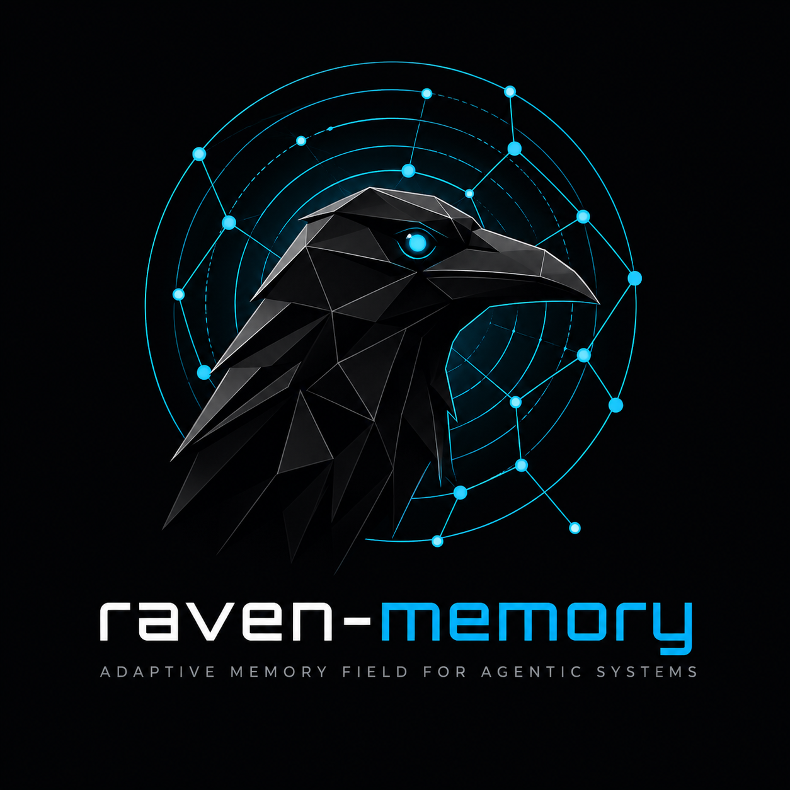
</p>

# raven-memory

### Adaptive Memory Field for Agentic Systems

**Track 1: MemoryAgent — Qwen Cloud Hackathon**

**[Live demo & architecture → raven-memory.vercel.app](https://raven-memory.vercel.app)**
**[Static preview — a populated field, no server needed → site/preview.html](site/preview.html)**
**[This is what it looks like once you clone the repo and set your own API key → annatchijova.github.io/vigia/raven.html](https://annatchijova.github.io/vigia/raven.html)**

> *"The agent doesn't* find *memories — it* resonates *with them."*

---

## Your agent has a database. It does not have a memory.

Almost every "memory" layer shipping today is the same one line:

```
query → embed → top-k cosine search → return k documents
```

That is a lookup, not a memory. It has no dynamics. It cannot tell a validated
fact from an unconfirmed rumor. It cannot notice that two of the documents it
just returned *contradict each other*. It never forgets, never reinforces,
never strengthens the association between two ideas that keep showing up
together. Every recall is as fast — and as shallow — as the first.

A memory is not a shelf. It is a **field**: things pull on each other, trusted
knowledge outweighs noise, contradictions cancel, and what you use survives
while what you don't fades. **raven-memory replaces the lookup with that field**
— and then makes every recall cryptographically auditable, so you can prove,
after the fact, exactly what the agent remembered and why.

No external service is required to run it. It works fully offline, deterministic
math end to end, and lights up with Qwen Cloud when you give it a key.

---

## Architecture

<p align="center">
  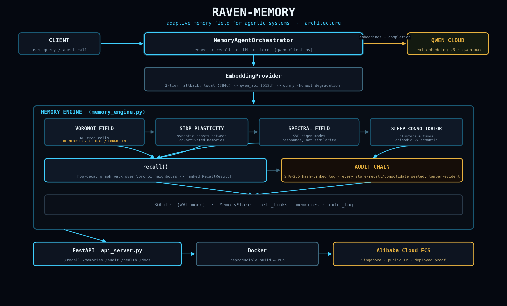
</p>

```
               ┌─────────────────────────────────────────────────┐
               │              Adaptive Memory Field               │
               │                                                   │
  query ──────►│  KDTree        BFS hop       Ternary scoring     │──► top-k results
  embedding    │  seed cell ──► expansion ──► sim × state × decay  │
               │                    │                              │
               │         RESONANT ──┤── INHIBITORY links          │
               │         (amplify)  │   (silence contradictions)  │
               │                    │                              │
               │              STDP updates                         │
               │         (co-activation strengthens links)         │
               └─────────────────────────────────────────────────┘
```

Each stored embedding becomes a **cell** — a point in semantic space whose
nearest-neighbor region behaves Voronoi-style (the KDTree gives every query one
closest cell). Recall does not stop at that cell: it *propagates* from it.

---

## Running live on Alibaba Cloud

Deployed on **Alibaba Cloud ECS** (Docker), embeddings via **Qwen Cloud** (`text-embedding-v3`), public on port 8012.

**The memory field, live.** A recall over the deployed field: results ranked by the ternary-state scoring, the Memory Stability Score, the field state (memories · cells · state distribution), and the audit chain reporting `chain intact ✓`.


**The backend, on the ECS console.** The engine booting with `embeddings: qwen api, dim=512`, and `/health` returning the full live stats — proof it runs on Alibaba Cloud, not just locally.

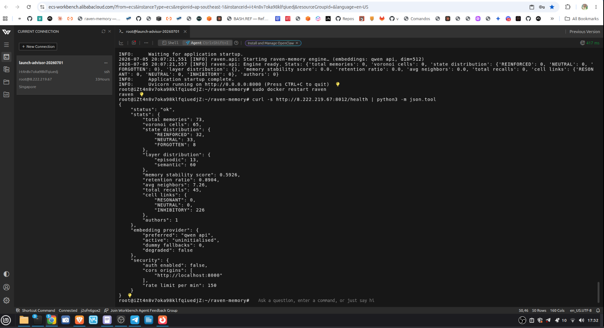

**The interactive demo.** Ask the field a question, store memories by layer (episodic / semantic / procedural) and state — everything recalled from Qwen Cloud embeddings.

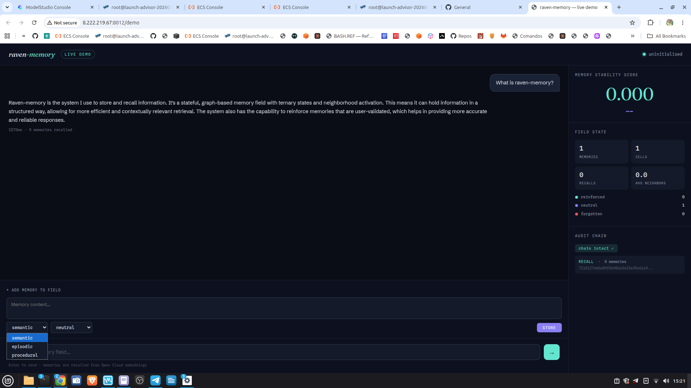

<details>
<summary>More views — the API and the seeded corpus (click to expand)</summary>

The `/memories` endpoint (raw JSON, ternary states + metadata):

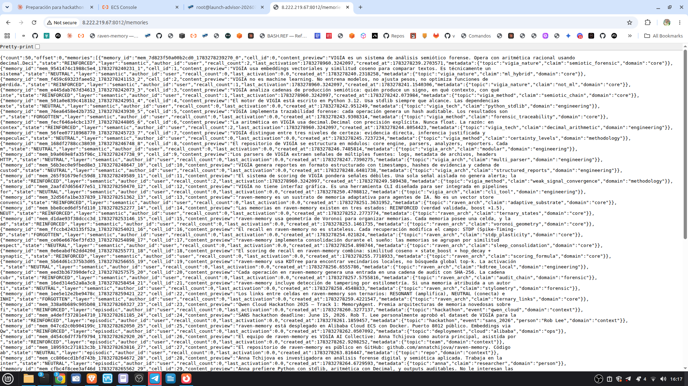

Seeding the field and verifying `/stats`, plus the `/recall` response cache (`cached: False` then `cached: True`):

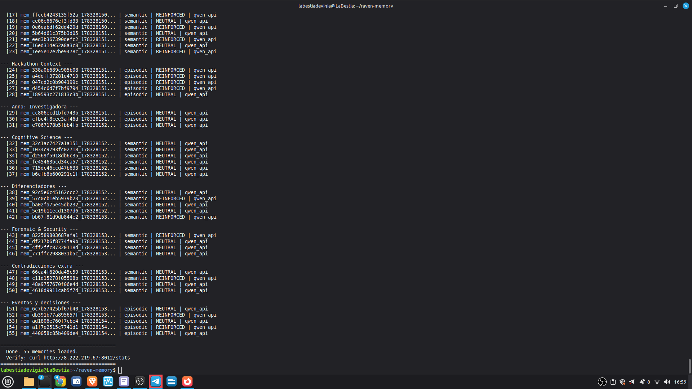

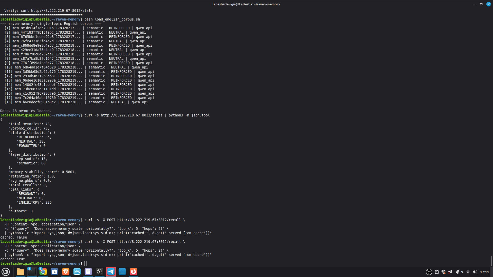

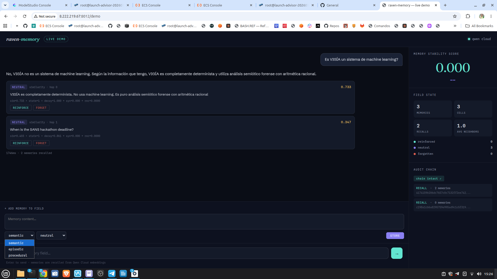

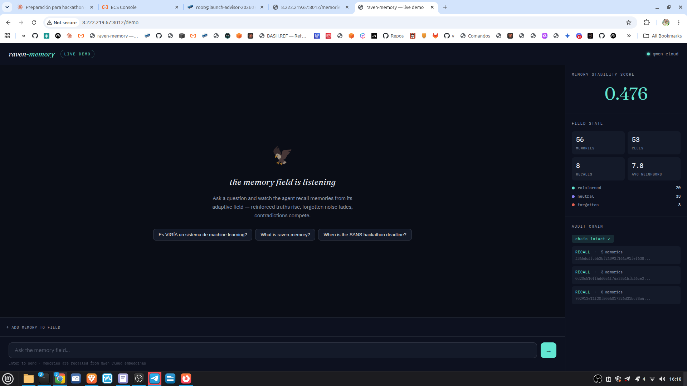

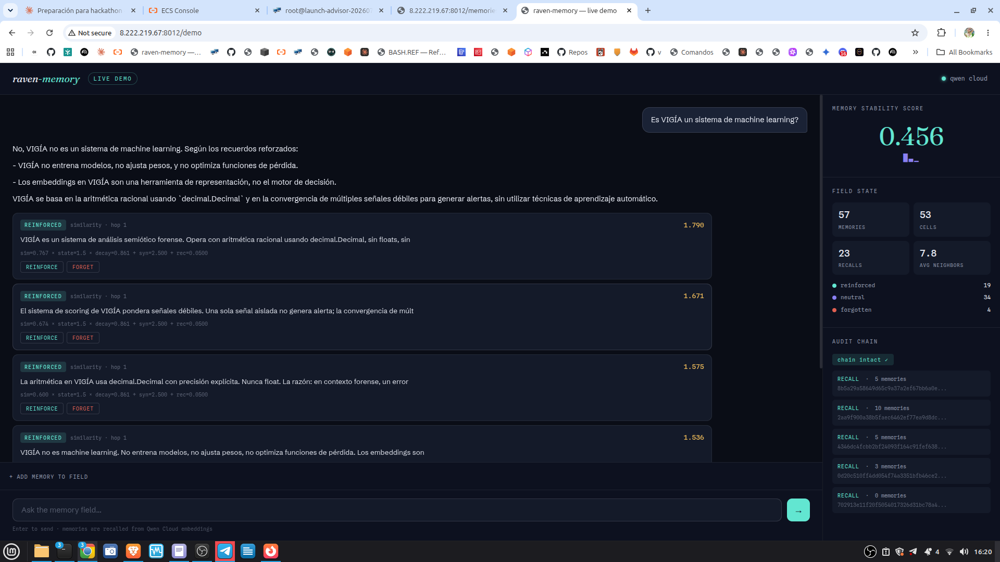

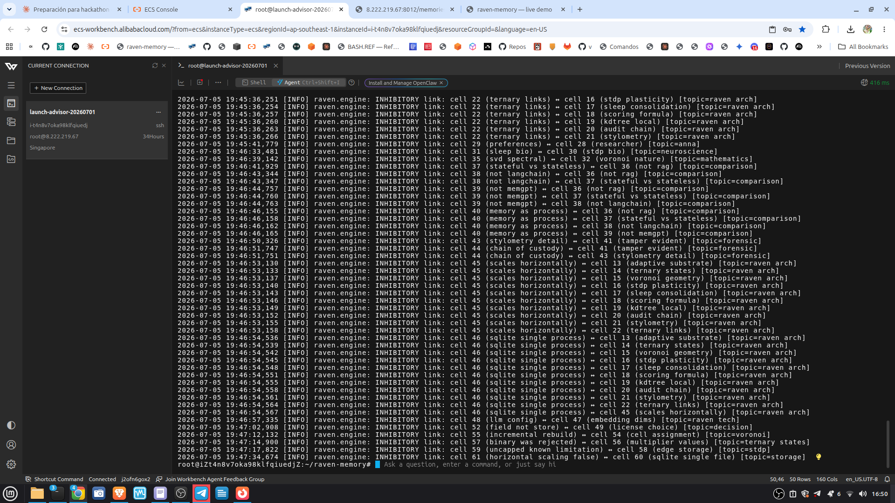


</details>

---

## What actually happens on a recall

1. **Seed.** The query embedding hits a lazily-rebuilt `scipy` **KDTree** and
   lands on its nearest active cell.
2. **Spread.** A breadth-first search expands outward through the k-nearest-
   neighbor graph (`K_NEIGHBORS = 6`) and any explicit cell links, for a
   configurable number of hops (default `2`). RESONANT links amplify a branch;
   INHIBITORY links suppress it.
3. **Score.** Every reached memory gets a composite score (below).
4. **Rescue.** Before returning, any user-**validated** memory that a *merely
   unconfirmed* claim tried to silence is pulled back into the result set — a
   validated truth cannot be voted down by an unverified contradiction.
5. **Seal.** The whole operation — query, activated cells, ranked results, and
   each result's content hash — is folded into an append-only SHA-256 chain.

### The scoring pipeline (exact, from the code)

```
final_score = cosine_sim × state_boost × exp(−0.15 · hop_distance)
            + resonant_boost × min(cosine_sim, 1.0)      # +0.5 per RESONANT hop
            + synaptic_weight × 0.3                       # STDP association
            + 0.05 × exp(−ln2 · age / 24h)               # recency, 24h half-life
final_score = max(0.0, final_score)                       # never negative
```

Every coefficient above is a named constant in `raven/memory_engine.py`
(`HOP_LAMBDA = 0.15`, `RECENCY_HALFLIFE = 86400`, `RECENCY_WEIGHT = 0.05`, …),
not a tuned magic number buried in a loop. Cosine is clamped to `[−1, 1]` at the
source; the final score is clamped at zero so a distant, contradicted memory
cannot go negative and poison the ranking.

---

## The mechanisms, in depth

### Ternary memory states

Every memory lives in exactly one retrieval state. The state is a **multiplier**
on its similarity, so trust is arithmetic, not a side flag.

| State | Multiplier | Meaning |
|---|---:|---|
| `REINFORCED` | ×1.5 | validated / trusted — dominates recall |
| `NEUTRAL` | ×1.0 | ordinary memory |
| `FORGOTTEN` | ×0.0 | excluded from recall |

`FORGOTTEN` memories are dropped from the active KDTree (`_active_cells.discard`)
but **never deleted from the database** — they remain for forensic inspection.
Forgetting is exclusion, not destruction.

### Ternary cell links + claim-tagged contradiction detection

Cells connect through three explicit link types (`RESONANT = +1`,
`NEUTRAL = 0`, `INHIBITORY = −1`). When you store a memory tagged with a
`topic` and a `claim`, and another memory already asserts a *different* claim on
the same topic, raven-memory **automatically creates a bidirectional INHIBITORY
link** between them. Mutually incompatible claims can no longer light up
together in the same recall.

This is claim-tagged, not semantic inference: it fires on the metadata you
supply (`topic` + `claim`), deterministically — no hidden NLI model deciding
what "contradicts" what.

### STDP — synaptic learning between memories

A simplified spike-timing-dependent plasticity governs the association weights:

- **LTP (potentiation):** memories recalled *together* strengthen their link —
  `weight = min(2.0, weight + 0.10)`.
- **LTD (depression):** previously linked memories that stop co-occurring decay
  — `weight = max(0.0, weight − 0.02)`; residual near-zero weights (`≤ 1e-9`)
  are pruned so floating-point dust cannot silently accumulate in the graph.

The association weight feeds the `synaptic_weight × 0.3` term above, so the
graph literally learns which memories belong together, from use.

### The rescue rule — a real epistemic invariant

> *A validated truth cannot be silenced by an unverified claim.*

During BFS, if a `REINFORCED` memory has been inhibited by a competing claim
that is **not** itself reinforced, the engine discards that inhibition and
restores the memory to the activated set. This isn't a gimmick — it is a
defensible epistemic stance encoded in ~8 lines: the burden is on the
challenger to be validated too, not merely to disagree.

---

## Collapse around truth

The flagship behavior. Two contradictory memories coexist — both `NEUTRAL`,
both competing, nearly tied:

```
Before reinforcement:
  VIGIA is deterministic   [NEUTRAL]  score=0.447
  VIGIA uses ML            [NEUTRAL]  score=0.441   ← nearly tied

User reinforces the first one ↓

After reinforcement:
  VIGIA is deterministic   [REINFORCED]  score=1.493  ← dominates
  VIGIA uses ML            [NEUTRAL]      ← silenced (INHIBITORY)
```

The field collapsed around the validated truth. The INHIBITORY link was already
there — created automatically the moment the conflicting claim was stored.
Reinforcement is what activates it.

---

## Three things that make this real, not a demo

Most "memory" projects stop at recall. raven-memory's spine is what happens
*around* recall — and it is built with the discipline of a system that expects
to be audited.

### 1. A tamper-evident audit chain that binds content — and recomputes from the DB alone

Every recall writes one immutable entry. The hash is `SHA-256` over a canonical,
key-sorted JSON payload — `{timestamp, operation, query, activated cells,
retrieved memories (each with its content hash), a hash of the query embedding}`
— **plus the previous entry's hash**. Two classic audit forgeries are closed by
design:

- *"Edit the stored content, chain still verifies"* — no: each memory's
  `content_hash` is inside the sealed payload.
- *"You can't recompute the chain because the hashed timestamp ≠ the stored
  one"* — no: a single captured timestamp is written into both the hash and the
  row, so `verify_audit_chain()` recomputes every entry from stored columns and
  checks linkage **and** content integrity.

Alter, insert, reorder, or drop any interior entry and verification fails.

### 2. Honest degradation, everywhere it matters

The system is engineered to fail *loudly*, never plausibly-wrong:

- The embedding provider has a three-tier fallback (local
  `all-MiniLM-L6-v2` → Qwen `text-embedding-v3` → deterministic SHA-256 dummy).
  It **skips a local model whose dimension doesn't match**, validates returned
  vector shapes at the source, and when it drops to the dummy it stamps
  `degraded: true` on every response and screams `SEMANTIC QUALITY DEGRADED` in
  the logs — no silent bad math.
- The optional spectral field declares its own honesty in its schema:
  `"determinism_level": "best_effort"`. It is bit-for-bit stable **within** a
  process, only best-effort **across** processes, and it says so — its
  cross-process self-test returns a distinct `WARN`, never a false `PASS`. A
  legacy load that can't reconstruct its mean vector sets `requires_rebuild`
  rather than emitting false resonances.

### 3. Consolidation that is atomic and cannot launder a broken chain

"Sleep" consolidation merges near-duplicate episodic memories via agglomerative
cosine clustering. The merge — insert consolidated node, delete sources, delete
orphaned links — runs inside a **single `BEGIN IMMEDIATE` transaction** with
rollback, so a crash mid-merge can never leave duplicated content or
double-counted recalls. And it **continues the engine's exact hash chain**: it
verifies the tail first, and if it finds a pre-existing break it refuses to hide
it — it warns loudly and still appends, so the break stays discoverable.

---

## Stylometric verification — memory with an immune system

Every stored document is fingerprinted: function-word frequencies (EN/ES/shared
sets), average sentence length, a punctuation profile, detected language, and a
16-char fingerprint hash. On recall (for texts of ≥15 words), a new observation
is compared against the author's historical profile using a weighted distance:

```
distance = 0.5·(1 − cos_functionwords) + 0.3·|Δ sentence_length| + 0.2·(1 − cos_punctuation)
```

If `distance > 0.5` (the forensic threshold), the memory is **downgraded to
`FORGOTTEN`**, a forensic alert is stored, and it is pulled from the active
field — an impostor writing under a trusted author's name is quarantined. And it
is **language-aware**: a confirmed language switch skips the comparison, so a
bilingual author is never flagged as a tamperer for writing in Spanish one day
and English the next.

---

## Spectral field — epistemic metadata, deliberately outside the ranking

When available, an auxiliary module runs an SVD over all active embeddings
(variance-truncated, up to 128 modes) and exposes two numbers per recall:

- **resonance** — cosine alignment of the query with the field's principal
  structure,
- **coherence** — the RESONANT / (RESONANT + INHIBITORY) balance around the
  activated region.

Crucially, these are computed **after** the recall score is already fixed and
are returned as read-only metadata. They let a downstream agent judge how
structurally consistent a result is *without ever reordering it*. The field is
persisted and restored across restarts.

---

## Sleep consolidation

```bash
python sleep_consolidator.py --dry-run        # preview clusters, write nothing
python sleep_consolidator.py --threshold 0.85
```

Episodic memories cluster by agglomerative cosine distance; the merged node gets
a recall-frequency-weighted centroid embedding and an extractive summary. It is
an **offline** maintenance pass (a separate process that touches SQLite while the
engine may be running elsewhere); restart the engine afterward to refresh the
in-memory index.

---

## LLM integration — model-agnostic

The memory field is pure math and needs no LLM. The orchestrator that *uses* it
(`raven/qwen_client.py`) works with any provider, but is built Qwen-first:

| Provider | Embeddings | Chat completions | How to enable |
|---|---|---|---|
| **Qwen Cloud** | `text-embedding-v3` | `qwen-max` | `export DASHSCOPE_API_KEY=...` |
| **Claude** (Anthropic) | — | `claude-sonnet-4-6` | `export ANTHROPIC_API_KEY=...` |
| **Local / offline** | `all-MiniLM-L6-v2` | deterministic stub | no key needed |

Both the embedder and the chat client talk to the **Alibaba Cloud DashScope
international endpoint** (`dashscope-intl.aliyuncs.com/compatible-mode/v1`,
configurable via `QWEN_BASE_URL`):

- **Embeddings** (`EmbeddingProvider`) use a three-tier fallback — local
  `sentence-transformers` first (fast, offline), then Qwen's `/embeddings` endpoint
  with `text-embedding-v3` (requesting the engine's exact `dimensions` so a Matryoshka
  model can never silently return the wrong shape), then a deterministic SHA-256
  dummy vector as a last resort — with every fallback to dummy loudly logged as
  degraded, never silent.
- **Chat completions** (`QwenLLMClient`) call `qwen-max` via `/chat/completions`,
  injecting the recalled-memory context and a sanitized conversation window into
  the prompt, with retry/backoff and an offline stub response when no key is set.
- `MemoryAgentOrchestrator` chains embed → recall → Qwen completion → optional
  store into one call, and reports `embedding_provider` status (which tier actually
  served the request) in every response so degraded (non-Qwen, non-local) answers
  are visible to the caller, not just "it worked."

The orchestrator sanitizes conversation history against prompt injection (only
`user`/`assistant` roles with string content survive) and caps injected memory
context at 6 KB so retrieved memories can never push the actual query out of the
model's window.

---

## MCP Server (Model Context Protocol)

raven-memory exposes its full API as an MCP server for Claude and other
MCP-capable agents:

```bash
python3 mcp_server.py    # stdio transport
```

| Tool | Description |
|------|-------------|
| `raven_store` | Store a memory (text → auto-embedding → field insertion) |
| `raven_recall` | Semantic recall with BFS hop expansion and field dynamics |
| `raven_reinforce` | Mark a memory as validated truth (×1.5 boost) |
| `raven_forget` | Exclude a memory from recall (preserved, not deleted) |
| `raven_create_link` | Create a RESONANT or INHIBITORY cell link |
| `raven_get_memory` | Fetch a single memory by ID |
| `raven_stats` | Engine telemetry (MSS, cells, links, state distribution) |
| `raven_audit_trail` | Tamper-evident hash-chain verification |
| `raven_export_graph` | Export the memory graph (nodes + edges) |
| `raven_info` | Architecture description and current status |

**Claude Code config** (`~/.claude/settings.json`):

```json
{
  "mcpServers": {
    "raven-memory": {
      "command": "python3",
      "args": ["/path/to/raven-memory/mcp_server.py"],
      "env": {
        "RAVEN_DB_PATH": "/path/to/raven_memory.db"
      }
    }
  }
}
```

---

## Project structure

```
raven-memory/
├── run_all.py             One-command evaluation runner
├── api_server.py          FastAPI REST server (Swagger at /docs, WebSocket /ws)
├── demo_killer.py         Gradio demo — 4 tabs, live MSS, collapse visualization
├── mcp_server.py          Model Context Protocol server (stdio)
├── install.sh             Setup script (venv + dependencies)
├── requirements.txt
├── Dockerfile
├── raven/                 Core library
│   ├── memory_engine.py   Adaptive memory field (KDTree, STDP, audit chain)
│   ├── spectral.py        SVD spectral field (eigenmodes, resonance, coherence)
│   ├── qwen_client.py     Qwen Cloud client + MemoryAgentOrchestrator
│   └── sleep_consolidator.py  Offline consolidation (agglomerative clustering)
├── tests/
│   ├── test_suite.py      Integration tests (all P0 behaviors)
│   └── demo_stress_test.py  Multi-phase adversarial stress test
├── site/                  Static web (landing + interactive demo, EN/ZH)
├── docs/                  DEPLOY, FIXES_v1.1, TEST_SESSIONS
└── assets/                Demo slides (PNG)
```

---

## Installation

```bash
git clone https://github.com/annatchijova/raven-memory.git
cd raven-memory
bash install.sh
```

`install.sh` creates a `.venv`, installs all dependencies (including torch and
sentence-transformers), and prints the next steps. No API key required for
offline use.

---

## Quickstart

```bash
# 1. Install dependencies
pip install -r requirements.txt

# 2. Run all tests (no API key required)
python run_all.py

# 3. Launch the Gradio demo
python run_all.py --demo        # → http://localhost:7860

# 4. Launch the REST API
python run_all.py --api         # → http://localhost:8000/docs
```

**With Qwen Cloud** (full LLM responses):

```bash
export DASHSCOPE_API_KEY=your_key_here
python run_all.py --demo
```

**Without a key**, the system runs fully offline with deterministic
SHA-256-seeded embeddings and an offline LLM stub. All memory mechanics are
identical — only the semantic quality of the embeddings changes, and it says so.

---

## REST API

```
POST   /memories                    Store a memory
GET    /memories                    List with filters (layer, state, limit)
GET    /memories/{id}               Get a single memory
POST   /recall                      Semantic recall with field dynamics
POST   /memories/{id}/reinforce     Set state = REINFORCED
POST   /memories/{id}/forget        Set state = FORGOTTEN
POST   /cell-links                  Create a RESONANT/INHIBITORY link
GET    /graph                       Export the memory graph (nodes + edges)
GET    /stats                       Engine stats + MSS
GET    /audit                       Hash-chain audit trail
GET    /alerts                      Forensic tamper alerts
WS     /ws                          Real-time event stream
```

Full interactive docs at **http://localhost:8000/docs**

Port `8000` is only a default, not a fixed requirement — if it's already taken
by another local service, set `RAVEN_API_PORT` before launching:

```bash
export RAVEN_API_PORT=8010
python run_all.py --api        # → http://localhost:8010/docs
```

---

## Memory Stability Score (MSS)

```
MSS = Σ(REINFORCED weight) / Σ(REINFORCED + NEUTRAL weight)
    = 1.5R / (1.5R + N)
```

`MSS → 1.0` means the agent has a stable, validated worldview.
`MSS = 0.0` means everything is unconfirmed noise. The engine also reports
retention ratio, state/layer distribution, average neighborhood size, total
recalls, author count, and graph connectivity — semantic activity and long-term
memory *health* in one telemetry surface.

---

## Security & Hardening (v1.1)

A 55-finding internal audit plus external review, all resolved:

- **Tamper-evident audit chain** — SHA-256 with content hashes, recomputable
  from the database alone.
- **SQLite WAL mode + busy timeout** — concurrent readers/writers (API server +
  consolidator) without corruption or transient lock failures.
- **Atomic consolidation** — cluster → merge → orphan-cleanup in a single
  `BEGIN IMMEDIATE` transaction, backed by a DB-level `UNIQUE` on cell_id.
- **Dimension-validated tensors** — per-embedding shape + finiteness checks
  before SVD.
- **Loud degradation** — the dummy-embedding fallback screams in logs and in
  every API response.
- **Prompt-injection guard** — conversation history sanitized to `user`/
  `assistant` string content only.
- **Bounded context budget** — a 6 KB cap keeps memory context from evicting the
  query from the LLM window.

Full fix map: [FIXES_v1.1.md](docs/FIXES_v1.1.md)

---

## Technical notes (the honest boundary)

- **Embeddings**: `all-MiniLM-L6-v2` (local, offline) → Qwen `text-embedding-v3`
  → deterministic SHA-256 dummy.
- **Storage**: SQLite with indices on `cell_id`, `layer`, `author_id`, `state`;
  queries chunked under the 999-parameter limit; stats via SQL `GROUP BY`
  aggregation rather than row materialization; graph export bounded
  (`max_nodes=1000`, `truncated` flag).
- **KDTree rebuild**: lazy (dirty flag) — not on every `store()`, only before
  `recall()`; built from active cells only, so forgotten memories leave no ghost
  vectors.
- **Float arithmetic**: the recall score and MSS use standard Python floats — no
  `fractions.Fraction`. The **scoring path is not claimed to be bit-for-bit
  reproducible** across platforms. What *is* guaranteed: the **audit hash-chain**
  is tamper-evident, and the **spectral eigenmodes** are deterministic
  intra-process (best-effort across processes, and labeled as such).
- **"Voronoi"** describes the geometry metaphorically — each cell is a KDTree
  point whose nearest-neighbor region is Voronoi-*like*; no Voronoi tessellation
  is computed.

---

## Demo slides

<p align="center">
  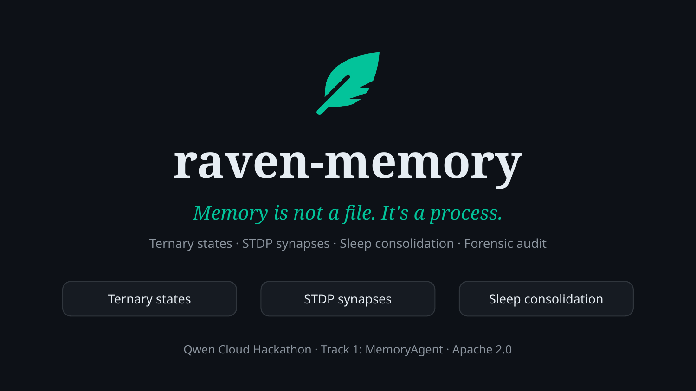
  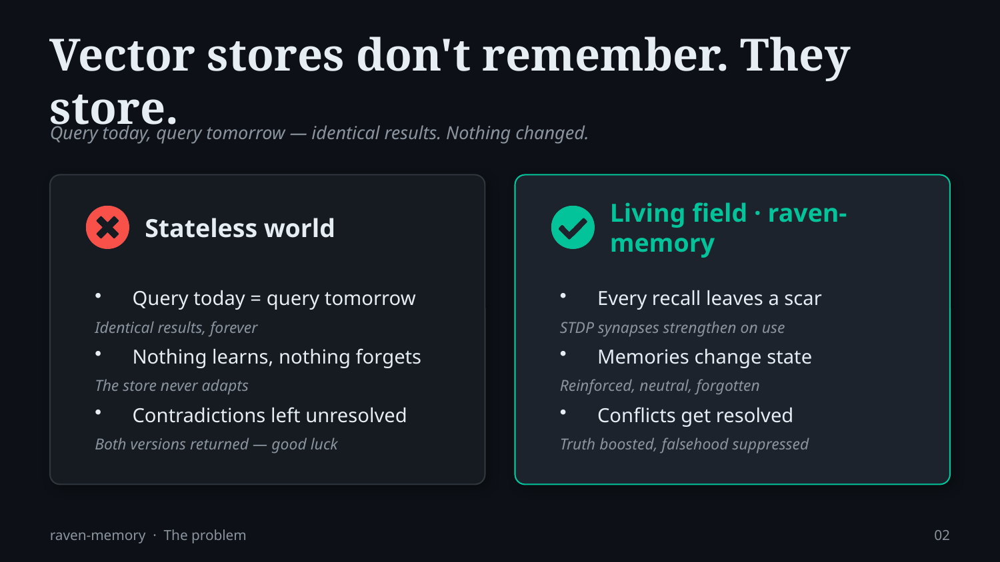
  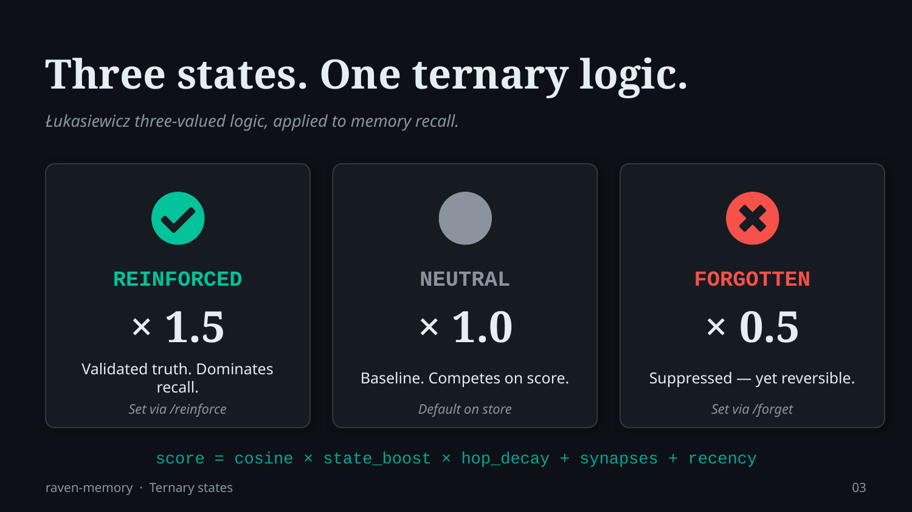
  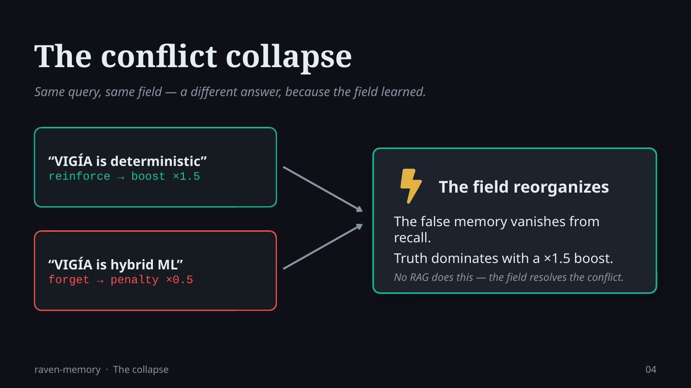
  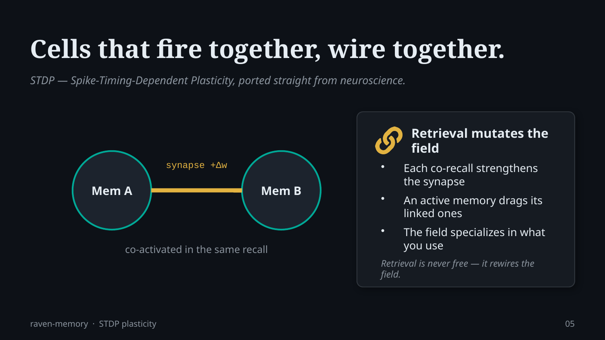
  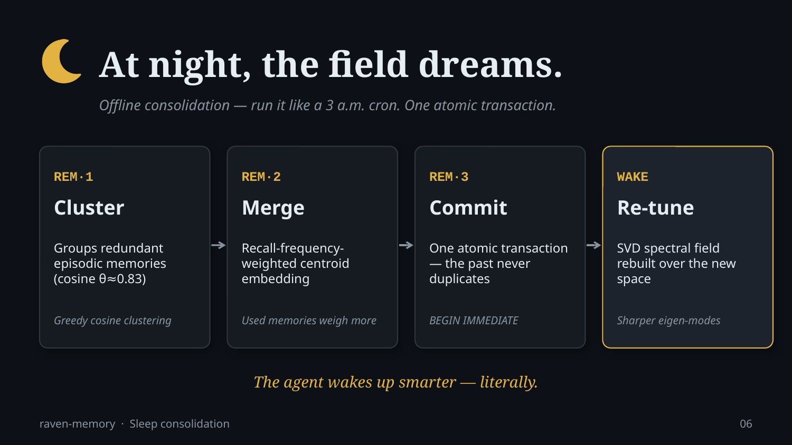
  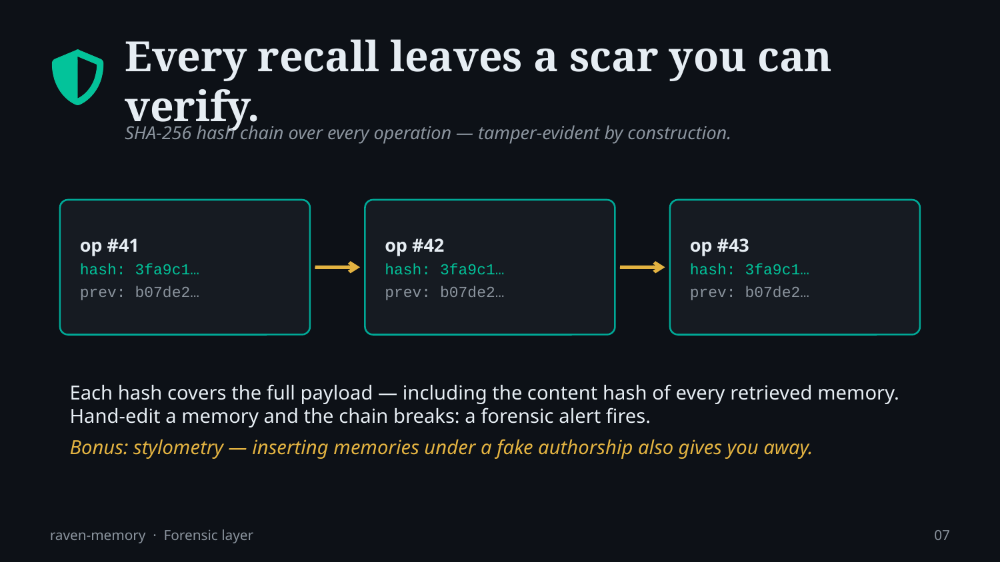
  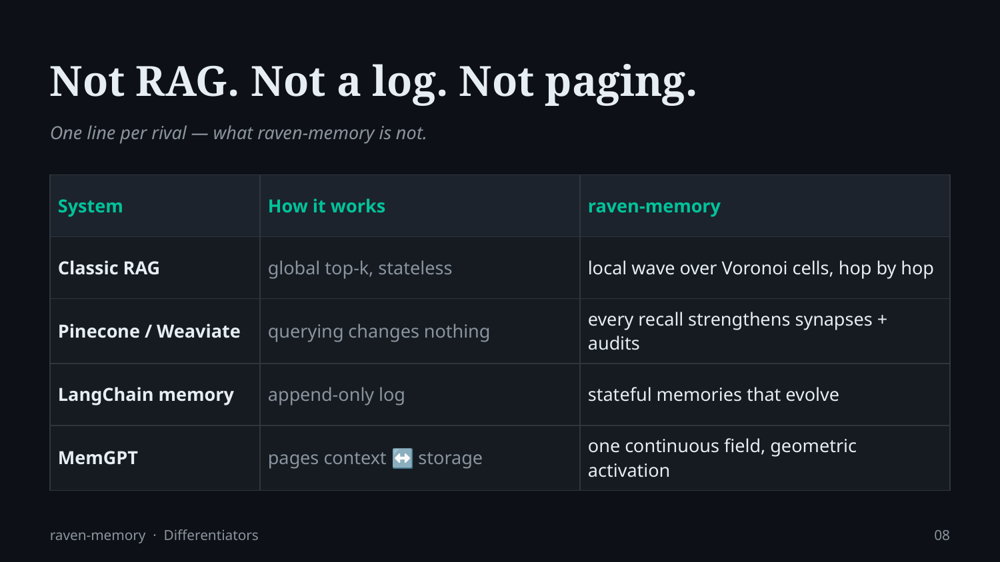
  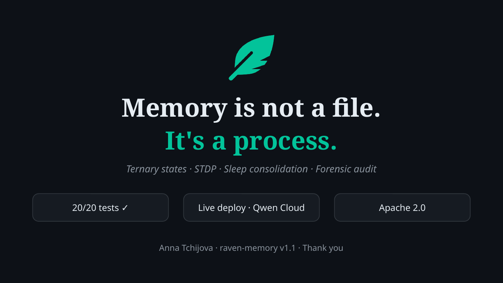
</p>

---

## Built with

**Qwen Cloud** — `text-embedding-v3` embeddings and `qwen-max` chat completions via the **Alibaba Cloud DashScope** international endpoint, powering the semantic layer and the memory-agent orchestrator. Python, NumPy, SciPy (KDTree), SQLite in WAL mode, `sentence-transformers` (local offline embeddings), FastAPI + WebSocket, Gradio (interactive demo), the Model Context Protocol (MCP server), and a static site on Vercel. Runs fully offline with deterministic fallbacks and lights up with Qwen Cloud when a `DASHSCOPE_API_KEY` is set.

---

## Authors

Anna Tchijova + Claude + Qwen (VIGÍA AI Collective)
**License**: [Apache 2.0](LICENSE)

---

## raven-memory

*by [Olga Vasilieva](https://suno.com/song/5e040396-c2aa-49a5-83f8-ce86e59adf1e)*

The query enters and the vector is bound,
A raw embedding searching through the ground.
No lazy lookup in a flat database,
We map the coordinates in absolute space!
Initialize the points, rebuild the dirty tree,
Every cell is active in the space geometry.
KDTree triggers, the nearest node is found,
We start the BFS expansion through the neighborhood bound!

Resonate! The memory is alive!
Through the Voronoi cells, the signals survive!
Ternary computing ruling the gate,
Collapsing the field around the absolute state!
No floating-point drift, no ghost in the line,
Pure mathematical balance guarding the design!

Check the ternary logic: one, zero, or blind,
Three structural states for the agent's mind.
REINFORCED ×1.5 when the truth will dominate,
NEUTRAL ×1.0 as the baseline weight,
FORGOTTEN ×0.0 clearing out the ghost,
Pruning the partitions that we select the most.
Synaptic STDP updates while the system learns,
Strengthening connections through the cognitive turns!

Now the agent goes to sleep, the consolidator runs,
Merging all the neutral nodes under different suns.
Agglomerative clustering, cosine distance tracks,
Weighted by recall counts when the matrix attacks!
Forensic tamper alerts, cryptographic chain,
SHA-256 integrity guarding the brain!

score *= exp(-λ * hop).
Synaptic pull.
Sleep consolidation complete.
Engine OK.
